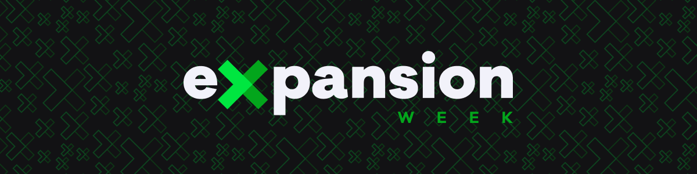

  

  
  
  

---

<h3 align="center">
  <a href="#information_source-sobre">Sobre</a>&nbsp;|&nbsp;
  <a href="#rocket">Tecnologias</a>&nbsp;|&nbsp;
  <a href="#licença">Licença</a>
</h3>

---

 

# ℹ️ Sobre

Repositório dedicado ao desafio proposto na 4ª Expansion Week da Rocketseat. O desafio era a criação de uma landing page falando sobre a soft skill que você julga ser mais importante para os dev.

Eu escolhi falar sobre Flexibilidade.

Quer conferir o resultado?

[O assunto é: Flexibilidade!](https://flexibility.netlify.app)

 

# 🚀 Tecnologias, Frameworks e Dependências

- [ReactJs](https://pt-br.reactjs.org/)
- [TypeScript](https://www.typescriptlang.org/)
- [React-router-dom](https://www.npmjs.com/package/react-router-dom)
- [Styled-components](https://styled-components.com/)
- [React-icons](https://www.npmjs.com/package/react-icons)
- [Polished](https://github.com/styled-components/polished)

 

## Licença

Esse projeto está sob a licença MIT. Veja o arquivo [LICENSE](LICENSE) para mais detalhes.
